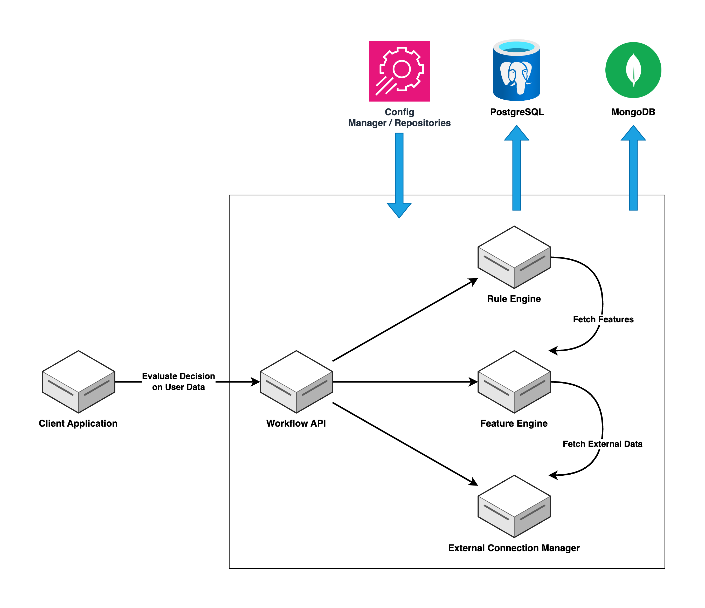

# CredForge Components

CredForge is built on two primary components - the **Config Manager** and the **Core APIs**, each composed of modular services that can be independently scaled and deployed.

## Core APIs

Exposes core APIs that orchestrate the decisioning workflow by integrating workflow management, rules processing, feature computation, and external system connectivity.

**Components:**

- **Workflow Manager**: Orchestrates the decisioning process by executing predefined workflows against user input variables, ensuring proper sequencing and state management.

- **Rule Engine**: Evaluates business rules and conditions through a configurable decision tree, enabling complex decision logic and policy enforcement.

- **Feature Engine**: Processes input variables through configurable feature computation pipelines, transforming raw data into meaningful decisioning features.

- **External Connection Manager**: Manages and orchestrates integrations with external services through configurable connection profiles and metadata-driven configurations.

- **Databases**:
    - **MongoDB**: Document database for storing system configurations, workflow definitions, rule sets, and integration metadata across all core decisioning components.
    - **PostgreSQL**: Relational database for managing transactional data, audit trails, and application logs with robust data integrity and query capabilities.

---

## Config Manager

⭐ `Releasing Soon, currently powered by Git. Follow below documentation for more.`

Responsible for orchestrating and managing the core decisioning components including workflow configuration, rules engine, feature computation engine, and external system integrations.

**Components:**

- **Admin Portal UI**: Provides an intuitive web interface for administrators to manage system configurations, monitor workflows, and control decisioning parameters.

- **Admin Portal Backend**: Exposes RESTful APIs to handle configuration management, export settings, and maintain system state across the decisioning platform.

- **Databases**:
    - **MongoDB**: Document database for storing versioned configurations, system metadata, and portal settings with support for configuration history and rollback capabilities.

**Components (Legacy deployments):**

Client-managed Git repositories that store versioned configuration files for each core API component, enabling version control and deployment management.

- **Git Repositories**:
    - `cred-forge-wm-configs`
    - `cred-forge-re-configs`
    - `cred-forge-fe-configs`
    - `cred-forge-ecm-configs`

---

Each component is designed to be **modular**, allowing independent scaling, deployment, and monitoring depending on workload or use-case.