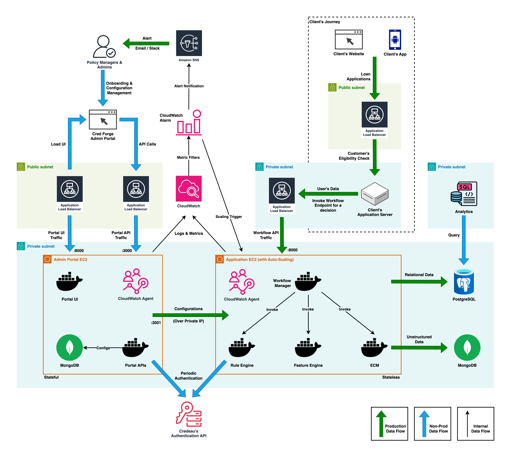

# CredForge

CredForge is a powerful decision-making platform that streamlines and accelerates the credit assessment process by eliminating technology barriers and enabling real-time decisioning capabilities.

CredForge aims to take the technology lag out of decision making process by providing:

- Configurable Integrations to external APIs for seamless data flow
- Python script upload capabilities for custom feature and score creation
- On-the-fly rule modification for dynamic decisioning
- End-to-end decisioning workflow testing and validation

## Key Features

- Flexible integration framework for external systems
- Customizable scoring and feature engineering
- Real-time rule engine for dynamic decisioning
- Comprehensive testing and validation tools
- Secure and compliant data handling
- Scalable architecture for high-volume processing

Explore the sections below to learn more about CredForge's components, integration capabilities, rule engine, and deployment strategies.

## Architecture Overview

The diagram below illustrates a typical deployment of the CredForge platform. It is intended as a reference architecture showcasing how various components work together in a production-grade setup.

This architecture highlights key components such as external API integrations, rule engine processing, feature computation, and the decisioning workflow that enables real-time credit assessment and decisioning.
