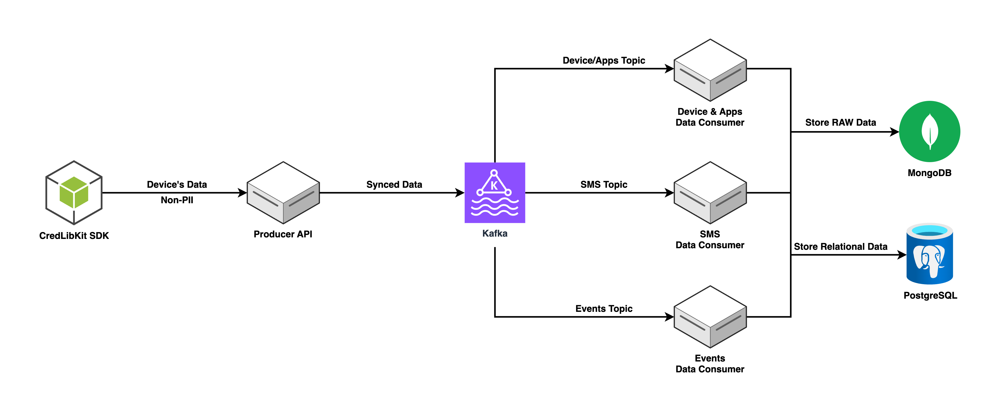
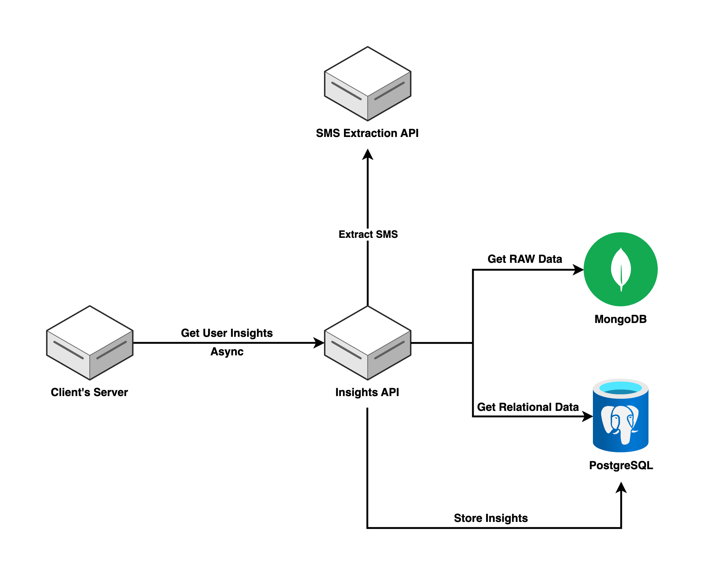

# MobileForge Components

MobileForge is built on two primary pipelines — the **Sync Pipeline** and the **Insights Pipeline**, each composed of modular services that can be independently scaled and deployed.

## Sync Pipeline

Responsible for securely ingesting data from mobile devices and storing it for downstream processing.

**Components:**

- **Producer API**: Receives raw data from mobile clients.

- **Kafka Stream**: Serves as the backbone for streaming data reliably between services.

- **Data Consumers**: Process and store incoming data from Kafka.
    - **SMS Data Consumer**
    - **Events Data Consumer**
    - **Device/Apps Data Consumer**

- **Databases (Write Layer)**:
    - **MongoDB**: Used for handling unstructured or semi-structured data.
    - **PostgreSQL**: Stores structured and relational data with integrity constraints.

---

## Insights Pipeline

Provides APIs for reading, profiling, and deriving insights from the synced data.

**Components:**

- **Insights API**: Delivers processed insights to institutional systems.

- **SMS Extraction API**: Extracts relevant financial signals from SMS data.

- **Databases (Read Layer)**:
    - **MongoDB**: Separate database instance within the same cluster, optimized for read access.
    - **PostgreSQL**: Read-optimized schema for efficient querying and reporting.

---

Each component is designed to be **modular**, allowing independent scaling, deployment, and monitoring depending on workload or use-case.
