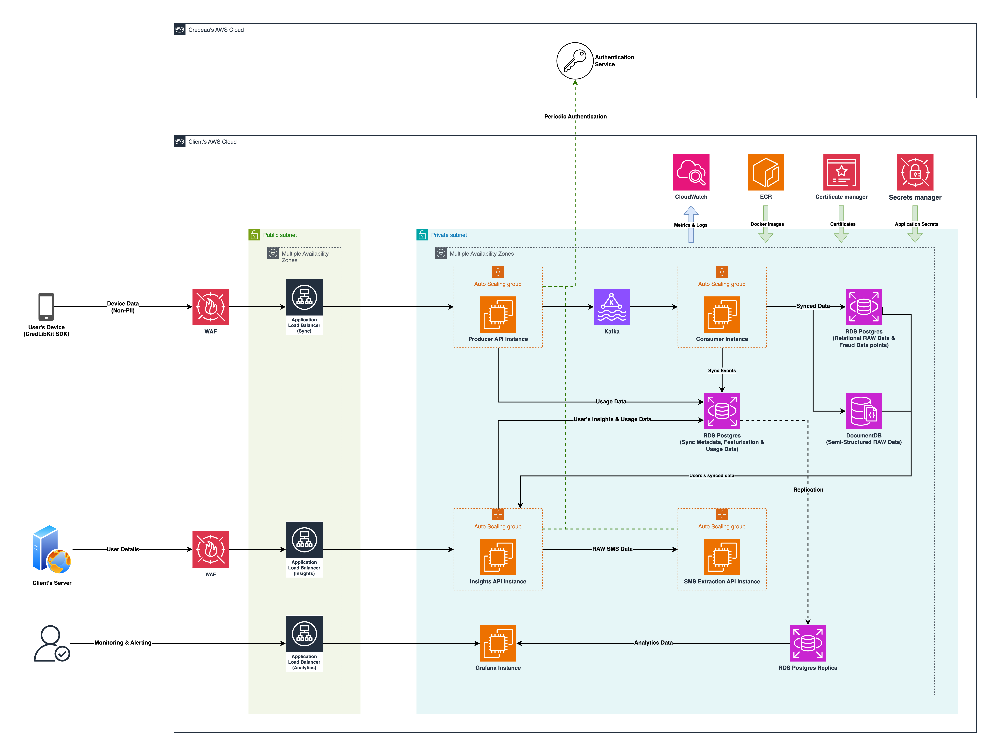

# MobileForge

MobileForge ensures that all data collected from user devices is securely transmitted directly to the institution’s infrastructure, where profiling and processing take place — maintaining full control and compliance within institutional premises.

## Key Features

- Modular architecture
- Scalable deployment options
- Robust data syncing with minimal drops
- Powerful data features and insights for user profiling  
- Utilizes open-source databases (MongoDB and PostgreSQL) for efficient and reliable data storage

Explore the sections below to learn more about MobileForge's components, deployment strategies, scaling guidelines, and data schemas.

## Architecture Overview

The diagram below illustrates a typical deployment of the MobileForge platform on AWS. It is intended as a reference architecture showcasing how various components work together in a production-grade setup.

This architecture highlights key components such as data ingestion from mobile devices, secure transmission to institutional infrastructure, robust data syncing, and the combined use of MongoDB and PostgreSQL for optimized storage and profiling operations.
